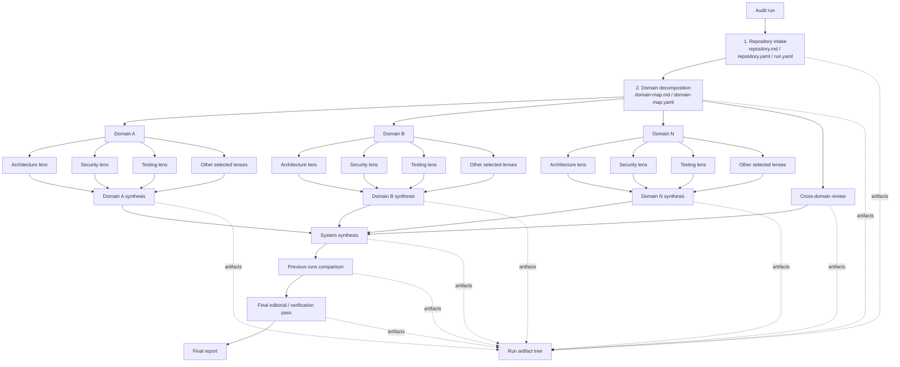

# Ultraudit Vision

Date: 2026-06-15  
Status: draft

## Summary

Ultraudit is a CLI tool for deep agentic review of applications.

The core idea is not to rely on one large prompt for a high-quality audit, but to build a reproducible review orchestrator. The tool runs a sequence of independent agent reviews, preserves their process artifacts, normalizes findings, merges results by domain, and produces a final system-level report.

The initial agent is Codex CLI. The practical execution model is that Ultraudit invokes an external console agent, for example through something like `codex exec`. For first-class agents, the invocation should be assembled by a typed builder inside Ultraudit instead of being stored as one raw shell string. Shell templates are needed as a fallback for custom agents.

## Goals

- Perform deep application review through multiple independent lenses.
- Split a project into domains or subdomains that become the units of analysis.
- Let agents access the whole project while keeping each run focused on a specific domain and lens.
- Save every agent run as a standalone artifact so results can be inspected, compared, and improved.
- Produce final markdown reports that are readable by humans.
- Store machine-readable findings in parallel for deduplication, run comparison, and future automation.
- Keep prompts and practices outside the binary so they can evolve independently.
- Run agents as external CLI processes instead of embedding a specific agent as a library.
- Build invocations for known agents through agent-specific invocation builders, and use shell templates only for custom integrations.

## Non-Goals For The First Version

- Do not try to replace static analyzers, dependency scanners, or test runners. They can be added later as evidence sources.
- Do not require hidden chain-of-thought from the agent. The tool only stores what the agent explicitly writes to stdout/stderr and artifacts.
- Do not build a web UI in the first version. A CLI and file-based output are enough for the first version.
- Do not allow fully automatic prompt/practice edits without approval. Rule evolution must be controlled.

## Core Principles

1. **Many small agent runs are better than one large run.**  
   Each run has a role, scope, lens, output format, and expected artifacts.

2. **Scope is not physically restricted.**  
   An agent may read the whole repository, but its findings must be tied to the assigned domain or to that domain's interactions with the rest of the system.

3. **Markdown for people, YAML/JSON for the system.**  
   Final reports should be easy to read. Findings should be structured so they can be compared across runs.

4. **Every run is reproducible.**  
   Ultraudit should preserve the git snapshot, config, prompt pack, invocation manifest, command summary, stdout/stderr, exit status, and all intermediate artifacts.

5. **Evidence first.**  
   A finding without concrete files, lines, scenarios, or a checkable reasoning summary should have low confidence or be dropped during synthesis/final review.

6. **Practices evolve separately.**  
   Prompt packs and practice documents live outside the CLI and are versioned. Agents may suggest changes, but applying those changes must be a separate controlled step.

7. **An agent is an external process.**  
   Ultraudit orchestrates other console-based agent tools. For the first version, this may be Codex CLI through `codex exec`; later, the same contract should support any compatible CLI agent.

8. **Use builders instead of raw commands for first-class agents.**  
   For known agents, Ultraudit should keep typed config and assemble the process invocation in code. This reduces quoting bugs, command injection risk, path issues, and prompt leaks through process arguments. Raw shell commands are allowed as an escape hatch for `CustomShellRunner`.

## Review Flow



### 1. Repository Intake

The tool collects baseline context:

- current git commit, branch, and dirty state;
- language, stack, package/build/test files;
- directory structure;
- available build and test commands, when they can be safely inferred;
- selected agent runner;
- selected lens packs;
- prompt pack version.

Outputs:

- `repository.md`;
- `repository.yaml`;
- `run.yaml`.

### 2. Domain Decomposition

The first agent step splits the project into domains or subdomains.

Each domain should include:

- stable `domain_id`;
- human-readable name;
- responsibility description;
- key files and directories;
- neighboring domains;
- external dependencies;
- possible risk areas;
- recommendations for which lenses are especially important for the domain.

Outputs:

- `domain-map.md`;
- `domain-map.yaml`.

### 3. Domain Lens Reviews

For each domain, Ultraudit runs a set of lens reviews.

Agent task framing:

> You are reviewing domain `<domain_id>`. You may read the whole project, but your findings must be related to this domain, its contracts, its dependencies, or its interactions with other domains. Do not perform a global review outside this perspective.

Each run should produce:

- markdown report for the domain and lens;
- structured findings;
- reviewer notes: what was inspected, which hypotheses were checked, where confidence was limited, and which files were key.

### 4. Cross-Domain Review

A separate agent step looks for system-level issues between domains:

- cyclic dependencies;
- implicit data ownership;
- duplicated business logic;
- conflicting assumptions;
- incompatible contracts;
- boundary ownership violations;
- security trust boundary gaps;
- shared performance bottlenecks;
- inconsistent observability and operational behavior.

### 5. Domain Synthesis

For each domain, a separate agent merges findings across all lenses:

- deduplicate issues;
- merge related findings;
- raise or lower severity;
- mark speculative findings;
- identify top domain risks;
- produce a domain-level remediation plan.

### 6. System Synthesis

System synthesis builds the overall picture for the application:

- top risks across the system;
- repeated patterns;
- most problematic domains;
- architectural themes;
- cross-domain findings;
- recommended roadmap;
- high-confidence findings separated from hypotheses.

### 7. Previous Runs Comparison

The tool should be able to inspect one or more previous runs.

Purpose:

- find repeated findings;
- find old findings missed by the current run;
- mark findings that were fixed or disappeared;
- detect contradictions between runs;
- understand which prompt/practice changes may have affected the result.

### 8. Final Editorial / Verification Pass

The final agent does not run another broad audit. Its job is to check the quality of the final report:

- every important finding has evidence;
- there are no duplicates;
- remarks are not too generic;
- severity is justified;
- impact and recommendation are clear;
- findings from previous runs were not lost;
- facts are separated from hypotheses.

## Review Lenses

### Initial / Default Lenses

1. **Architecture**  
   Boundaries, ownership, coupling, dependency direction, module structure, extensibility.

2. **Code Quality / Maintainability**  
   Local complexity, readability, duplication, naming, cohesion, error handling, refactoring risks.

3. **Security**  
   Auth/authz, injection, secrets, unsafe defaults, trust boundaries, privilege escalation, supply of untrusted input.

4. **Correctness**  
   Edge cases, invariants, state transitions, race conditions, incorrect assumptions, business logic bugs.

5. **Testing**  
   Regression coverage, critical path coverage, integration tests, flaky risks, test quality, missing negative cases.

### Full Deep Review Lenses

6. **Reliability / Resilience**  
   Timeouts, retries, idempotency, partial failures, recovery, graceful degradation, consistency under failure.

7. **Performance / Scalability**  
   Algorithmic complexity, N+1 queries, memory pressure, blocking in async code, cache misuse, lock contention, startup time, runtime latency, backpressure.

8. **Observability**  
   Logs, metrics, tracing, error context, production debuggability, audit trails, alertability.

9. **Operations / Deployment**  
   Config management, secrets, deploy safety, rollback, environment drift, local/prod parity, migrations during deploy.

10. **API / Contract Design**  
    Public interfaces, backward compatibility, versioning, error semantics, schema evolution, contract clarity.

11. **Data Integrity**  
    Transactions, migrations, constraints, consistency, data ownership, backup/restore assumptions, data loss risks.

12. **Privacy / Compliance**  
    PII handling, retention, auditability, data minimization, access boundaries, vendor exposure.

13. **Dependency / Supply Chain**  
    Outdated dependencies, abandoned packages, risky transitive dependencies, license risks, build script risks.

14. **UX / Product Behavior**  
    User-facing flows, accessibility, empty/error states, confusing behavior, consistency, recoverability from user mistakes.

15. **ML / AI Systems Review**  
    Evals, prompt/RAG/tool-calling quality, prompt injection, data exfiltration, hallucination risks, fallback behavior, train/serve skew, dataset provenance, dataset leakage, model drift, latency, token/cost budget, PII exposure to model vendors, reproducibility, human approval gates.

### Supplemental Optics

Core lenses remain the stable taxonomy for findings and packs. Supplemental optics are opt-in checks that use the same evidence-first contract, but are not included in the `full` pack by default until they have enough dry-run evidence and an acceptable false-positive rate.

1. **Documentation / Knowledge**
   Documentation as an operational knowledge system: source of truth, lifecycle, ownership, discoverability, onboarding routes, runbook quality, stale or conflicting docs, and links between docs and delivery, incident, and release flows. This should not become a writing-style review: a finding needs operational, onboarding, support, safety, compliance, or delivery impact.

### Stack And Language Overlays

The lens defines the risk type, while the stack overlay refines evidence and false-positive checks for a specific technology. The same finding can have `security` or `reliability` as its primary lens while using `rust`, `python`, `typescript`, `html-css`, `swift`, or `kotlin` practice refs.

Initial stack overlays:

- language overlays: Rust, Python, TypeScript, HTML/CSS, Swift, Kotlin;
- application overlays: CLI tools, async/concurrent systems, backend APIs, web frontend, mobile applications, desktop applications, databases and migrations, distributed systems, AI/RAG/agentic systems, deployment and operations.

Stack overlays do not replace lenses and should not create a separate global language audit. Their job is to provide reviewable failure modes: unsafe/escape hatches, runtime boundary validation, async lifecycle, package-manager semantics, rendered UI/accessibility evidence, platform privacy metadata, model/eval artifacts, and other stack-specific signals.

## Lens Packs

The CLI should support named packs:

```yaml
packs:
  default:
    - architecture
    - code-quality
    - security
    - correctness
    - testing

  production:
    - reliability
    - performance
    - observability
    - operations

  contracts-and-data:
    - api-contracts
    - data-integrity
    - privacy-compliance
    - dependency-supply-chain

  product:
    - ux-product
    - ml-ai

  full:
    - architecture
    - code-quality
    - security
    - correctness
    - testing
    - reliability
    - performance
    - observability
    - operations
    - api-contracts
    - data-integrity
    - privacy-compliance
    - dependency-supply-chain
    - ux-product
    - ml-ai
```

CLI examples:

```bash
ultraudit run --pack full
ultraudit run --pack production
ultraudit run --lens performance --lens security
ultraudit run --domain auth --pack default
ultraudit run --optic documentation-knowledge
```

## Finding Contract

Every finding should have a structured form:

```yaml
id: security-auth-001
title: Session validation bypass in refresh flow
domain: auth
lens: security
severity: high
confidence: medium
status: open
evidence:
  - file: crates/auth/src/session.rs
    lines: "120-155"
    note: Expiry is checked after session rotation.
impact: Expired refresh tokens may be accepted in some paths.
recommendation: Validate token expiry before rotating the session.
effort: medium
tags:
  - auth
  - session
  - token-lifecycle
related_findings: []
```

Base fields:

- `id`;
- `title`;
- `domain`;
- `lens`;
- `severity`: `critical | high | medium | low | info`;
- `confidence`: `high | medium | low`;
- `status`: `open | accepted-risk | fixed | false-positive | needs-recheck`;
- `evidence`;
- `impact`;
- `recommendation`;
- `effort`;
- `tags`;
- `related_findings`.

## Run Directory Structure

Suggested structure:

```text
.audit-runs/
  2026-06-15_18-40-22/
    run.yaml
    repository.md
    repository.yaml
    domain-map.md
    domain-map.yaml
    prompts/
      base-reviewer.md
      domain-discovery.md
      synthesis.md
      final-editor.md
      lenses/
        architecture.md
        security.md
    raw/
      001-domain-discovery/
        invocation.yaml
        command.txt
        prompt.md
        stdout.log
        stderr.log
        exit.json
        reviewer-notes.md
      002-auth-architecture/
        invocation.yaml
        command.txt
        prompt.md
        stdout.log
        stderr.log
        exit.json
        reviewer-notes.md
    findings/
      auth.architecture.yaml
      auth.security.yaml
      cross-domain.yaml
    reports/
      domains/
        auth.md
        billing.md
      previous-runs-comparison.md
      system-review.md
      final-report.md
    suggestions/
      prompt-improvements.md
      practice-improvements.md
```

## Traces And Process Artifacts

Ultraudit should preserve the visible process output of every agent run.

This includes:

- rendered prompt;
- invocation manifest: program, args, cwd, redacted env, stdin source, timeout, output paths;
- rendered command summary for human inspection;
- stdout;
- stderr;
- exit status;
- generated markdown;
- generated YAML/JSON findings;
- reviewer notes;
- self-critique or confidence notes, if requested in the prompt;
- list of files the agent considered important, if the agent provides it.

This is not a request for hidden chain-of-thought. The goal is explainability for developing the tool itself: another agent or a human should be able to inspect `prompt -> process notes -> findings -> final report` and understand where the review worked, where it missed something, and how prompts or practices should evolve.

## External Prompts And Practices Layer

Prompts and practices should live outside the binary and should not be tied to one project. The default storage location is the user-level system directory `~/.ultraudit`, so the same review knowledge can be reused across repositories.

Project-local config may select a pack and version, but should not be the only place where practices live:

```text
~/.ultraudit/
  config.toml
  packs/
    ultraudit-default/
      versions/
        0.1.0/
          pack.toml
          prompts/
            base-reviewer.md
            domain-discovery.md
            domain-synthesis.md
            system-synthesis.md
            previous-runs-comparison.md
            final-editor.md
          lenses/
            architecture/
              lens.toml
              prompt.md
              practices.md
              evidence.md
              false-positives.md
            code-quality/
              lens.toml
              prompt.md
              practices.md
            security/
              lens.toml
              prompt.md
              practices.md
              evidence.md
              false-positives.md
            correctness/
            testing/
            reliability/
            performance/
            observability/
            operations/
            api-contracts/
            data-integrity/
            privacy-compliance/
            dependency-supply-chain/
            ux-product/
            ml-ai/
          overlays/
            rust/
              overlay.toml
              practices.md
              evidence.md
              false-positives.md
            python/
            typescript/
            html-css/
            swift/
            kotlin/
            cli/
            async-concurrent/
            backend-api/
            web-frontend/
            mobile-apps/
            desktop-apps/
            database/
            distributed-systems/
            operations/
            ml-ai/
          optics/
            documentation-knowledge/
              optic.toml
              prompt.md
              practices.md
          atoms/
            rust-async-blocking.yaml
          suggestions/
            pending/
        0.2.0/
          pack.toml

.audit/
  config.toml
  agents/
    codex.toml
    custom-shell.toml
```

Example project-local selection:

```toml
[prompt_pack]
name = "ultraudit-default"
version = "0.1.0"
source = "~/.ultraudit/packs/ultraudit-default/versions/0.1.0"
```

Version directories are the switching boundary. A run must resolve exactly one pack version before review starts, record that version in the invocation manifest, and copy or checksum the resolved pack into the run artifacts. This keeps old reports explainable even after practices evolve.

Lens, overlay, and optic files have different responsibilities:

- `lenses/` define the stable finding taxonomy and the risk perspective;
- `overlays/` add stack-specific failure modes, evidence signals, and false-positive checks;
- `optics/` define opt-in supplemental checks that are not part of the default/full pack until proven useful;
- `prompts/` define reusable templates and task instructions;
- `atoms/` may hold structured practice atoms for cases where machine-readable selection is useful.

Self-evolving behavior must be controlled:

1. agent proposes prompt/practice changes;
2. Ultraudit saves them into `suggestions/` next to the relevant pack version;
3. a human or explicit approval flow accepts the changes;
4. accepted changes become part of the next prompt pack version instead of mutating a version that has already been used.

## Agent Runner Abstraction

An agent runner is an adapter around an external console agent tool. Ultraudit should not depend on the agent's internal implementation. It prepares the prompt and context, builds the process invocation, starts the external CLI process, collects stdout/stderr, checks exit status, and reads the expected artifacts.

For first-class agents, config should be declarative instead of a full shell command:

```toml
[agents.codex]
kind = "codex-cli"
binary = "codex"
mode = "exec"
prompt_transport = "stdin"
approval_policy = "never"
sandbox = "workspace-write"
timeout_seconds = 7200
```

`CodexInvocationBuilder` reads this config and turns it into a concrete `AgentInvocation` for each run, domain, lens, and output directory.

The shell-template runner is a fallback for unknown agents:

```toml
[agents.experimental]
kind = "shell-template"
shell = "bash"
command = "my-agent review --prompt-file {{ prompt_path }} --output-dir {{ output_dir }}"
timeout_seconds = 7200
```

This should be treated as less safe and less portable than a first-class builder.

Builder-level interface:

```rust
trait AgentInvocationBuilder {
    fn build(&self, request: &AgentRunRequest) -> Result<AgentInvocation>;
}

struct AgentInvocation {
    program: PathBuf,
    args: Vec<OsString>,
    cwd: PathBuf,
    env: BTreeMap<String, OsString>,
    stdin: StdinSource,
    stdout_path: PathBuf,
    stderr_path: PathBuf,
    timeout: Duration,
}
```

The prompt should preferably be passed through `stdin` or a prompt file, not as a long CLI argument. This reduces the risk of prompt exposure through the process list and avoids argument length limits.

Base interface:

```rust
trait AgentRunner {
    async fn run(&self, request: AgentRequest) -> Result<AgentResult>;
}
```

Expected runners:

- `CodexCliRunner`;
- `CustomShellRunner`;
- future API-based runners;
- future multi-agent backends.

`AgentRequest` should include:

- working directory;
- rendered prompt;
- run metadata;
- expected output paths;
- environment variables;
- prompt transport;
- timeout;
- agent-specific options.

`AgentResult` should include:

- exit status;
- stdout path;
- stderr path;
- invocation manifest path;
- artifact paths;
- parsed findings, if available;
- error metadata.

## Suggested Rust Stack

- `clap` for CLI;
- `tokio` for async orchestration and parallel agent runs;
- `serde`, `serde_yaml`, `serde_json`, `toml` for configs and artifacts;
- `schemars` for schemas;
- `tracing` for logs;
- `ignore` for repository walking with `.gitignore` support;
- `tokio::process` for agent execution without shell where possible;
- `minijinja` for prompt templates;
- `uuid` and `chrono` for run IDs;
- `anyhow` and `thiserror` for error handling.

## First-Version Plan

The first version is not a temporary throwaway prototype. It should be the working foundation of Ultraudit: a real prompt/practice pack, a reproducible run flow, preserved artifacts, and a clear path for incremental improvement.

Research on review practices is already an input to implementation. The next step is to materialize that research into the initial `~/.ultraudit` pack and build the tool around that pack.

### Phase 1: Initial Prompt/Practice Pack

- Create the first `~/.ultraudit/packs/ultraudit-default/versions/0.1.0` structure.
- Convert research results into initial lenses, overlays, optics, and practice atoms.
- Prepare base prompts: reviewer, domain discovery, domain synthesis, system synthesis, previous-run comparison, final editor.
- Define `pack.toml`, schema version, supported lenses, overlays, and default/full pack selection.
- Record source-backed assumptions, research gaps, and refresh triggers.

### Phase 2: CLI Orchestrator

- CLI with a `run` command.
- `.audit/config.toml` for project-local settings and prompt pack selection.
- `~/.ultraudit` discovery and prompt pack resolution.
- Codex CLI runner and `CodexInvocationBuilder`.
- Run directory creation.
- Prompt rendering from the resolved pack.
- Raw stdout/stderr and invocation manifest capture.

### Phase 3: Domain Discovery

- Repository intake.
- Domain decomposition prompt.
- `domain-map.md` and `domain-map.yaml`.
- Basic schema validation.

### Phase 4: Lens Reviews

- Default lens pack from the resolved `~/.ultraudit` version directory.
- Per-domain/per-lens agent runs.
- Structured findings extraction.
- Raw process artifacts.

### Phase 5: Synthesis

- Domain synthesis.
- Cross-domain review.
- System synthesis.
- Final editorial pass.

### Phase 6: Historical Comparison

- Compare the current run with previous runs.
- Track repeated, missing, fixed, and conflicting findings.
- Include previous-runs analysis in the final report.

### Phase 7: Prompt/Practice Evolution

- Save improvement suggestions.
- Add explicit approval flow.
- Create a new version directory for the accepted prompt/practice pack.

## Researched Practices Layer

The practices layer should be assembled from source-backed lens packs, stack overlays, and opt-in supplemental optics. Research artifacts live outside the binary and should preserve:

- source maps and coverage matrices;
- practice atoms;
- evidence signals;
- false-positive checks;
- severity/confidence hints;
- prompt guidance;
- research gaps and refresh triggers.

Baseline areas:

- architecture review frameworks;
- secure code review methodology;
- reliability engineering and resilience patterns;
- performance review methodology by stack;
- testing strategy and test quality;
- observability standards;
- API compatibility and schema evolution;
- data integrity and migration safety;
- privacy and PII handling;
- dependency and supply-chain risk;
- frontend UX/accessibility review;
- ML/AI system evaluation, prompt injection, evals, and model monitoring;
- agentic tool safety, approval boundaries, and auditability.
- language-specific review guidance for Rust, Python, TypeScript, HTML/CSS, Swift, and Kotlin;
- documentation/knowledge review guidance as a supplemental optic.

## Success Criteria

Ultraudit is useful if:

- repeated runs produce comparable findings;
- final reports contain concrete evidence, not generic advice;
- domain-level reports help teams act locally;
- system-level reports reveal repeated patterns and cross-domain risks;
- previous-run comparison catches regressions and omissions;
- prompts and practices can improve without changing the CLI core;
- a future agent can read a run and explain how to improve the tool.
