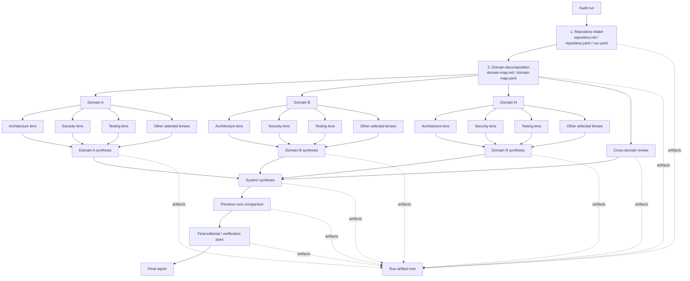

# Ultraudit Vision

Дата: 2026-06-15  
Статус: draft

## Коротко

Ultraudit - консольная утилита для глубокого агентского review приложений.

Главная идея: не пытаться получить качественный аудит одним большим prompt'ом, а построить воспроизводимый review orchestrator. Утилита запускает серию независимых агентских проверок, сохраняет их процессные артефакты, нормализует findings, объединяет результаты по доменам и собирает финальный отчет по всей системе.

Изначальный агент - Codex CLI. Практическая модель запуска: Ultraudit вызывает внешнюю консольную утилиту агента, например через что-то вроде `codex exec`. Для first-class агентов вызов должен собираться typed builder'ом внутри Ultraudit, а не храниться как одна сырая shell-строка. Shell templates нужны как fallback для кастомных агентов.

## Цели

- Делать глубокое review приложений с несколькими независимыми оптиками.
- Разбивать проект на домены или поддомены, которые становятся единицами анализа.
- Давать агентам доступ ко всему проекту, но удерживать фокус каждого запуска на конкретном домене и конкретной оптике.
- Сохранять каждый агентский запуск как отдельный артефакт, чтобы результаты можно было проверять, сравнивать и улучшать.
- Собирать финальные markdown-отчеты, пригодные для чтения человеком.
- Параллельно сохранять machine-readable findings для дедупликации, сравнения запусков и последующей автоматизации.
- Сделать внешний слой prompts/practices, который можно развивать отдельно от бинарника.
- Запускать агентов как внешние CLI-процессы, а не встраивать конкретного агента как библиотеку.
- Собирать вызовы известных агентов через agent-specific invocation builders; использовать shell templates только для кастомных интеграций.

## Не цели первой версии

- Не пытаться заменить статические анализаторы, dependency scanners и тестовые раннеры. Их можно подключать позже как источники evidence.
- Не требовать от агента скрытый chain-of-thought. Утилита сохраняет только то, что агент явно выдает в stdout/stderr и в артефактах.
- Не делать web UI в первой версии. CLI и файловая структура достаточно хороши для первой версии.
- Не обещать полностью автоматическую правку prompts/practices без approval. Эволюция правил должна быть контролируемой.

## Базовые принципы

1. **Много маленьких агентских запусков лучше одного большого.**  
   Каждый запуск имеет роль, scope, оптику, формат результата и ожидаемые артефакты.

2. **Scope не обрезается физически.**  
   Агент может читать весь репозиторий, но его findings должны быть связаны с заданным доменом или взаимодействиями этого домена с остальной системой.

3. **Markdown для людей, YAML/JSON для системы.**  
   Финальные отчеты должны быть удобны для чтения. Findings должны быть структурированы, чтобы их можно было сравнивать между runs.

4. **Каждый run воспроизводим.**  
   Нужно сохранять git snapshot, конфиг, prompt pack, invocation manifest, command summary, stdout/stderr, exit status и все промежуточные артефакты.

5. **Evidence first.**  
   Finding без конкретных файлов, строк, сценариев или проверяемого reasoning summary должен иметь низкую уверенность или отбрасываться на synthesis/final pass.

6. **Практики развиваются отдельно.**  
   Prompt pack и practice documents лежат снаружи CLI и версионируются. Агенты могут предлагать изменения, но применение изменений должно быть отдельным контролируемым шагом.

7. **Агент - внешний процесс.**  
   Ultraudit оркестрирует другие консольные агентские утилиты. Для первой версии это может быть Codex CLI через `codex exec`; позже тот же контракт должен поддерживать любые совместимые CLI-агенты.

8. **Builder вместо raw command для first-class агентов.**  
   Для известных агентов Ultraudit должен хранить typed config и собирать процессный вызов внутри кода. Это снижает риск ошибок quoting, command injection, проблем с пробелами в путях и утечек prompt'ов через аргументы процесса. Raw shell command допустим как escape hatch для `CustomShellRunner`.

## Review Flow



### 1. Repository Intake

Утилита собирает базовый контекст:

- текущий git commit, branch и dirty state;
- язык, стек, package/build/test файлы;
- структуру директорий;
- доступные команды сборки и тестов, если их можно безопасно определить;
- выбранный agent runner;
- выбранные lens packs;
- версию prompt pack.

Результат:

- `repository.md`;
- `repository.yaml`;
- `run.yaml`.

### 2. Domain Decomposition

Первый агентский шаг разбивает проект на домены или поддомены.

Каждый домен должен иметь:

- стабильный `domain_id`;
- человекочитаемое название;
- описание ответственности;
- ключевые файлы и директории;
- соседние домены;
- внешние зависимости;
- возможные risk areas;
- рекомендации, какие оптики особенно важны для этого домена.

Результат:

- `domain-map.md`;
- `domain-map.yaml`.

### 3. Domain Lens And Optic Reviews

Для каждого домена запускается набор lens reviews и все enabled supplemental optic reviews из выбранного pack.

Постановка задачи агенту:

> Ты ревьюишь домен `<domain_id>`. Ты можешь читать весь проект, но твои findings должны быть связаны с этим доменом, его контрактами, зависимостями или взаимодействиями с другими доменами. Не делай глобальное review вне этой призмы.

Каждый запуск должен выдавать:

- markdown-отчет по домену и lens/optic;
- structured findings;
- reviewer notes: что смотрел, какие гипотезы проверял, где не хватило уверенности, какие файлы были ключевыми.

### 4. Cross-Domain Review

Отдельный агентский шаг ищет системные проблемы между доменами:

- циклические зависимости;
- неявное владение данными;
- дублирование бизнес-логики;
- конфликтующие assumptions;
- несовместимые контракты;
- нарушение boundary ownership;
- security trust boundary gaps;
- общие performance bottlenecks;
- несогласованность observability и operational behavior.

### 5. Domain Synthesis

Для каждого домена отдельный агент объединяет findings всех оптик:

- дедуплицирует проблемы;
- объединяет связанные findings;
- повышает или понижает severity;
- помечает speculative findings;
- выделяет top risks домена;
- формирует domain-level remediation plan.

### 6. System Synthesis

Системный synthesis собирает картину по всему приложению:

- top risks по всей системе;
- repeated patterns;
- наиболее проблемные домены;
- architectural themes;
- cross-domain findings;
- recommended roadmap;
- high-confidence findings отдельно от гипотез.

### 7. Previous Runs Comparison

Утилита должна уметь смотреть предыдущий или несколько предыдущих runs.

Цель:

- найти findings, которые повторяются;
- найти старые findings, которые текущий run пропустил;
- отметить исправленные или исчезнувшие findings;
- обнаружить противоречия между runs;
- понять, какие изменения в prompts/practices могли повлиять на результат.

### 8. Final Editorial / Verification Pass

Последний агент не делает еще один широкий аудит. Его задача - проверить качество финального отчета:

- есть ли evidence у каждого важного finding;
- нет ли дубликатов;
- нет ли слишком общих замечаний;
- обоснована ли severity;
- понятны ли impact и recommendation;
- не потерялись ли findings из предыдущих runs;
- отделены ли факты от гипотез.

## Review Lenses

### Initial / Default Lenses

1. **Architecture**  
   Boundaries, ownership, coupling, dependency direction, module structure, extensibility.

2. **Code Quality / Maintainability**  
   Local complexity, readability, duplication, naming, cohesion, error handling, refactoring risks.

3. **Security**  
   Auth/authz, injection, secrets, unsafe defaults, trust boundaries, privilege escalation, supply of untrusted input.

4. **Correctness**  
   Edge cases, invariants, state transitions, race conditions, incorrect assumptions, business logic bugs.

5. **Testing**  
   Regression coverage, critical path coverage, integration tests, flaky risks, test quality, missing negative cases.

### Full Deep Review Lenses

6. **Reliability / Resilience**  
   Timeouts, retries, idempotency, partial failures, recovery, graceful degradation, consistency under failure.

7. **Performance / Scalability**  
   Algorithmic complexity, N+1 queries, memory pressure, blocking in async code, cache misuse, lock contention, startup time, runtime latency, backpressure.

8. **Observability**  
   Logs, metrics, tracing, error context, production debuggability, audit trails, alertability.

9. **Operations / Deployment**  
   Config management, secrets, deploy safety, rollback, environment drift, local/prod parity, migrations during deploy.

10. **API / Contract Design**  
    Public interfaces, backward compatibility, versioning, error semantics, schema evolution, contract clarity.

11. **Data Integrity**  
    Transactions, migrations, constraints, consistency, data ownership, backup/restore assumptions, data loss risks.

12. **Privacy / Compliance**  
    PII handling, retention, auditability, data minimization, access boundaries, vendor exposure.

13. **Dependency / Supply Chain**  
    Outdated dependencies, abandoned packages, risky transitive dependencies, license risks, build script risks.

14. **UX / Product Behavior**  
    User-facing flows, accessibility, empty/error states, confusing behavior, consistency, recoverability from user mistakes.

15. **ML / AI Systems Review**  
    Evals, prompt/RAG/tool-calling quality, prompt injection, data exfiltration, hallucination risks, fallback behavior, train/serve skew, dataset provenance, dataset leakage, model drift, latency, token/cost budget, PII exposure to model vendors, reproducibility, human approval gates.

### Supplemental Optics

Core lenses остаются стабильной таксономией для findings и packs. Supplemental optics используют тот же evidence-first контракт, но не становятся частью stable lens taxonomy. Обычный запуск должен включать все supplemental optics, определенные в выбранной версии pack, включая `Nice Practices`; флаг `--optic` нужен для focused run одной supplemental optic или узкого набора optics.

1. **Documentation / Knowledge**
   Документация как рабочая система знания: source of truth, lifecycle, ownership, discoverability, onboarding routes, runbook quality, stale/conflicting docs, связь docs с delivery, incident и release flows. Не должна превращаться в style review текста: finding нужен только при operational, onboarding, support, safety, compliance или delivery impact.

2. **Nice Practices**
   Персональная оптика для практик, которые владелец Ultraudit сознательно хочет сохранять и переносить между проектами. Это не претензия на универсальные best practices: практика может быть вкусовой, стековой, продуктовой, процессной или архитектурной, если она явно помечена как личное предпочтение и не маскируется под общий риск. Findings из этой оптики должны объяснять, какая локальная практика нарушена, почему она важна для текущего проекта и какой trade-off она несет.

### Stack And Language Overlays

Lens определяет тип риска, а stack overlay уточняет evidence и false-positive checks для конкретной технологии. Один и тот же finding может быть `security` или `reliability` по primary lens, но использовать `rust`, `python`, `typescript`, `html-css`, `swift` или `kotlin` practice refs.

Начальный набор stack overlays:

- language overlays: Rust, Python, TypeScript, HTML/CSS, Swift, Kotlin;
- application overlays: CLI tools, async/concurrent systems, backend APIs, web frontend, mobile applications, desktop applications, databases and migrations, distributed systems, AI/RAG/agentic systems, deployment and operations.

Stack overlays не заменяют линзы и не должны создавать отдельный глобальный аудит языка. Их задача - подсказать reviewable failure modes: unsafe/escape hatches, runtime boundary validation, async lifecycle, package-manager semantics, rendered UI/accessibility evidence, platform privacy metadata, model/eval artifacts и другие stack-specific сигналы.

## Lens Packs

CLI должен поддерживать именованные packs для core lenses. Supplemental optics из выбранной версии pack запускаются по умолчанию вместе с выбранным pack, если project-local config явно не отключил конкретную optic:

```yaml
packs:
  default:
    - architecture
    - code-quality
    - security
    - correctness
    - testing

  production:
    - reliability
    - performance
    - observability
    - operations

  contracts-and-data:
    - api-contracts
    - data-integrity
    - privacy-compliance
    - dependency-supply-chain

  product:
    - ux-product
    - ml-ai

  full:
    - architecture
    - code-quality
    - security
    - correctness
    - testing
    - reliability
    - performance
    - observability
    - operations
    - api-contracts
    - data-integrity
    - privacy-compliance
    - dependency-supply-chain
    - ux-product
    - ml-ai
```

Примеры CLI:

```bash
ultraudit run --pack full
ultraudit run --pack production
ultraudit run --lens performance --lens security
ultraudit run --domain auth --pack default
ultraudit run --optic documentation-knowledge
ultraudit run --optic nice-practices
```

## Finding Contract

Каждый finding должен иметь структурированную форму:

```yaml
id: security-auth-001
title: Session validation bypass in refresh flow
domain: auth
lens: security
severity: high
confidence: medium
status: open
evidence:
  - file: crates/auth/src/session.rs
    lines: "120-155"
    note: Expiry is checked after session rotation.
impact: Expired refresh tokens may be accepted in some paths.
recommendation: Validate token expiry before rotating the session.
effort: medium
tags:
  - auth
  - session
  - token-lifecycle
related_findings: []
```

Базовые поля:

- `id`;
- `title`;
- `domain`;
- `lens`;
- `severity`: `critical | high | medium | low | info`;
- `confidence`: `high | medium | low`;
- `status`: `open | accepted-risk | fixed | false-positive | needs-recheck`;
- `evidence`;
- `impact`;
- `recommendation`;
- `effort`;
- `tags`;
- `related_findings`.

## Run Directory Structure

Предлагаемая структура:

```text
.audit-runs/
  2026-06-15_18-40-22/
    run.yaml
    repository.md
    repository.yaml
    domain-map.md
    domain-map.yaml
    prompts/
      base-reviewer.md
      domain-discovery.md
      synthesis.md
      final-editor.md
      lenses/
        architecture.md
        security.md
    raw/
      001-domain-discovery/
        invocation.yaml
        command.txt
        prompt.md
        stdout.log
        stderr.log
        exit.json
        reviewer-notes.md
      002-auth-architecture/
        invocation.yaml
        command.txt
        prompt.md
        stdout.log
        stderr.log
        exit.json
        reviewer-notes.md
    findings/
      auth.architecture.yaml
      auth.security.yaml
      cross-domain.yaml
    reports/
      domains/
        auth.md
        billing.md
      previous-runs-comparison.md
      system-review.md
      final-report.md
    suggestions/
      prompt-improvements.md
      practice-improvements.md
```

## Трейсы и процессные артефакты

Ultraudit должен сохранять видимый процессный output каждого агентского запуска.

Сюда входят:

- rendered prompt;
- invocation manifest: program, args, cwd, redacted env, stdin source, timeout, output paths;
- rendered command summary for human inspection;
- stdout;
- stderr;
- exit status;
- generated markdown;
- generated YAML/JSON findings;
- reviewer notes;
- self-critique or confidence notes, if requested in the prompt;
- list of files the agent considered important, if the agent provides it.

Это не запрос на hidden chain-of-thought. Цель - explainability для развития самой утилиты: другой агент или человек должен иметь возможность посмотреть `prompt -> process notes -> findings -> final report` и понять, где review сработало, где что-то пропустило, и как должны эволюционировать prompts или practices.

## Внешний слой prompts/practices

Prompts и practices должны жить вне бинарника и не должны быть привязаны к одному проекту. Базовое место хранения - пользовательская системная директория `~/.ultraudit`, чтобы один и тот же набор review knowledge можно было использовать между разными репозиториями.

Project-local config может выбирать pack и версию, но не должен быть единственным местом хранения практик:

```text
~/.ultraudit/
  config.toml
  packs/
    ultraudit-default/
      versions/
        0.1.0/
          pack.toml
          prompts/
            base-reviewer.md
            domain-discovery.md
            domain-synthesis.md
            system-synthesis.md
            previous-runs-comparison.md
            final-editor.md
          lenses/
            architecture/
              lens.toml
              prompt.md
              practices.md
              evidence.md
              false-positives.md
            code-quality/
              lens.toml
              prompt.md
              practices.md
            security/
              lens.toml
              prompt.md
              practices.md
              evidence.md
              false-positives.md
            correctness/
            testing/
            reliability/
            performance/
            observability/
            operations/
            api-contracts/
            data-integrity/
            privacy-compliance/
            dependency-supply-chain/
            ux-product/
            ml-ai/
          overlays/
            rust/
              overlay.toml
              practices.md
              evidence.md
              false-positives.md
            python/
            typescript/
            html-css/
            swift/
            kotlin/
            cli/
            async-concurrent/
            backend-api/
            web-frontend/
            mobile-apps/
            desktop-apps/
            database/
            distributed-systems/
            operations/
            ml-ai/
          optics/
            documentation-knowledge/
              optic.toml
              prompt.md
              practices.md
            nice-practices/
              optic.toml
              prompt.md
              practices.md
          atoms/
            rust-async-blocking.yaml
          suggestions/
            pending/
        0.2.0/
          pack.toml

.audit/
  config.toml
  agents/
    codex.toml
    custom-shell.toml
```

Example project-local selection:

```toml
[prompt_pack]
name = "ultraudit-default"
version = "0.1.0"
source = "~/.ultraudit/packs/ultraudit-default/versions/0.1.0"
```

Version directories are the switching boundary. A run must resolve exactly one pack version before review starts, record that version in the invocation manifest, and copy or checksum the resolved pack into the run artifacts. This makes old reports explainable even after practices evolve.

Lens, overlay, and optic files have different responsibilities:

- `lenses/` define the stable finding taxonomy and the risk perspective;
- `overlays/` add stack-specific failure modes, evidence signals, and false-positive checks;
- `optics/` define supplemental checks that are not part of the stable lens taxonomy, but are included in default runs unless explicitly disabled;
- `prompts/` define reusable templates and task instructions;
- `atoms/` may hold structured practice atoms for cases where machine-readable selection is useful.

Self-evolving поведение должно быть контролируемым:

1. агент предлагает изменения prompts/practices;
2. Ultraudit сохраняет их в `suggestions/` рядом с соответствующей версией pack;
3. человек или явный approval flow принимает изменения;
4. принятые изменения становятся частью следующей версии prompt pack, а не мутируют уже использованную версию.

## Абстракция Agent Runner

Agent runner - это адаптер над внешней консольной агентской утилитой. Ultraudit не должен зависеть от внутренней реализации агента. Он готовит prompt и контекст, строит процессный вызов, запускает внешний CLI-процесс, собирает stdout/stderr, проверяет exit status и читает ожидаемые артефакты.

Для first-class агентов config должен быть декларативным, а не полной shell-командой:

```toml
[agents.codex]
kind = "codex-cli"
binary = "codex"
mode = "exec"
prompt_transport = "stdin"
approval_policy = "never"
sandbox = "workspace-write"
timeout_seconds = 7200
```

Такой config читает `CodexInvocationBuilder` и превращает его в конкретный `AgentInvocation` для каждого run, домена, lens и output directory.

Shell-template runner нужен как fallback для неизвестных агентов:

```toml
[agents.experimental]
kind = "shell-template"
shell = "bash"
command = "my-agent review --prompt-file {{ prompt_path }} --output-dir {{ output_dir }}"
timeout_seconds = 7200
```

Его стоит считать менее безопасным и менее переносимым режимом, чем first-class builder.

Builder-level интерфейс:

```rust
trait AgentInvocationBuilder {
    fn build(&self, request: &AgentRunRequest) -> Result<AgentInvocation>;
}

struct AgentInvocation {
    program: PathBuf,
    args: Vec<OsString>,
    cwd: PathBuf,
    env: BTreeMap<String, OsString>,
    stdin: StdinSource,
    stdout_path: PathBuf,
    stderr_path: PathBuf,
    timeout: Duration,
}
```

Prompt желательно передавать через `stdin` или prompt-файл, а не как длинный CLI-аргумент. Это уменьшает риск утечки prompt'а через process list и снимает ограничения длины аргументов.

Базовый интерфейс:

```rust
trait AgentRunner {
    async fn run(&self, request: AgentRequest) -> Result<AgentResult>;
}
```

Ожидаемые runner'ы:

- `CodexCliRunner`;
- `CustomShellRunner`;
- будущие API-based runners;
- будущие multi-agent backends.

`AgentRequest` должен включать:

- working directory;
- rendered prompt;
- run metadata;
- expected output paths;
- environment variables;
- prompt transport;
- timeout;
- agent-specific options.

`AgentResult` должен включать:

- exit status;
- stdout path;
- stderr path;
- invocation manifest path;
- artifact paths;
- parsed findings, если доступны;
- error metadata.

## Предлагаемый Rust-стек

Консольную утилиту стоит строить вокруг `clap`, а не писать парсинг аргументов вручную. Первая реализация должна использовать derive API из `clap` для typed commands и flags, Cargo-backed `--version` metadata, сгенерированный help, примеры в long help, value-enum validation для packs/lenses/optics и `clap_complete` для shell completions.

Начальные CLI-зависимости:

- `clap` с features `derive`, `env` и `wrap_help` для commands, flags, typed values, environment fallbacks и форматированного help;
- `clap_complete` для bash, zsh, fish, PowerShell и elvish completions;
- `anstream` и `anstyle` для color-aware human output, который может учитывать возможности терминала и `NO_COLOR`;
- `assert_cmd` и `predicates` для end-to-end CLI tests поверх собранного бинарника.

Core implementation dependencies:

- `tokio` для async orchestration и параллельных agent runs;
- `serde`, `serde_yaml`, `serde_json`, `toml` для configs и artifacts;
- `schemars` для schemas;
- `tracing` и `tracing-subscriber` для logs;
- `ignore` для обхода репозитория с учетом `.gitignore`;
- `tokio::process` для agent execution без shell там, где это возможно;
- `minijinja` для prompt templates;
- `uuid` и `chrono` для run IDs;
- `anyhow` и `thiserror` для error handling.

Опциональные terminal UX dependencies можно добавлять, когда появятся соответствующие реальные features:

- `indicatif` для progress bars и spinners вокруг долгих agent jobs;
- `comfy-table` для читаемых terminal summaries по runs, domains и findings.

## План первой версии

Первая версия не является временным throwaway-прототипом. Она должна быть рабочей основой Ultraudit: с реальным prompt/practice pack, воспроизводимым run flow, сохранением артефактов и понятной траекторией последующих улучшений.

Research по review practices уже считается входом для реализации. Следующий шаг - материализовать результаты research в initial `~/.ultraudit` pack и построить утилиту вокруг этого pack.

### Phase 1: Initial Prompt/Practice Pack

- Создать первую структуру `~/.ultraudit/packs/ultraudit-default/versions/0.1.0`.
- Перенести результаты research в initial lenses, overlays, optics и practice atoms.
- Создать `nice-practices` optic с минимальным prompt placeholder без содержательных предпочтительных практик.
- Подготовить базовые prompts: reviewer, domain discovery, domain synthesis, system synthesis, previous-run comparison, final editor.
- Описать `pack.toml`, schema version, supported lenses, overlays, supplemental optics и default/full pack selection.
- Зафиксировать source-backed assumptions, research gaps и refresh triggers.

### Phase 2: CLI Orchestrator

- CLI с командой `run`.
- `.audit/config.toml` для project-local настроек и выбора prompt pack.
- `~/.ultraudit` discovery и prompt pack resolution.
- Codex CLI runner и `CodexInvocationBuilder`.
- Создание run-директории.
- Рендеринг prompts из resolved pack.
- Сохранение raw stdout/stderr и invocation manifest.

### Phase 3: Domain Discovery

- Repository intake.
- Domain decomposition prompt.
- `domain-map.md` and `domain-map.yaml`.
- Базовая schema validation.

### Phase 4: Lens And Optic Reviews

- Default lens pack и все enabled supplemental optics из resolved `~/.ultraudit` version directory.
- Агентские запуски per-domain/per-lens и per-domain/per-optic.
- Извлечение structured findings.
- Raw process artifacts.

### Phase 5: Synthesis

- Domain synthesis.
- Cross-domain review.
- System synthesis.
- Final editorial pass.

### Phase 6: Historical Comparison

- Сравнение текущего run с предыдущими runs.
- Отслеживание repeated, missing, fixed и conflicting findings.
- Включение previous-runs analysis в финальный отчет.

### Phase 7: Prompt/Practice Evolution

- Сохранение improvement suggestions.
- Явный approval flow.
- Заполнение `nice-practices` реальными предпочтительными практиками как последнего шага первой версии, после того как базовый run flow и approval flow уже работают.
- Создание новой version directory для принятого prompt/practice pack.

## Слой исследованных практик

Слой practices должен собираться из source-backed lens packs, stack overlays и supplemental optics. Исследовательские артефакты живут вне бинарника и должны сохранять:

- source maps и coverage matrices;
- practice atoms;
- evidence signals;
- false-positive checks;
- severity/confidence hints;
- prompt guidance;
- research gaps и refresh triggers.

Базовые направления:

- architecture review frameworks;
- secure code review methodology;
- reliability engineering and resilience patterns;
- performance review methodology by stack;
- testing strategy and test quality;
- observability standards;
- API compatibility and schema evolution;
- data integrity and migration safety;
- privacy and PII handling;
- dependency and supply-chain risk;
- frontend UX/accessibility review;
- ML/AI system evaluation, prompt injection, evals and model monitoring;
- agentic tool safety, approval boundaries and auditability;
- language-specific review guidance for Rust, Python, TypeScript, HTML/CSS, Swift and Kotlin;
- documentation/knowledge review guidance as a supplemental optic;
- Nice Practices как персональная supplemental optic для проектных предпочтений, которые должны оставаться явными, а не превращаться в универсальные правила.

## Критерии успеха

Ultraudit полезен, если:

- repeated runs дают сравнимые findings;
- финальные отчеты содержат конкретное evidence, а не общие советы;
- domain-level reports помогают командам действовать локально;
- system-level reports показывают повторяющиеся patterns и cross-domain risks;
- previous-run comparison ловит регрессии и пропуски;
- prompts и practices можно улучшать без изменения CLI core;
- будущий агент может прочитать run и объяснить, как улучшить утилиту.
